# Mermaid 图表

Mermaid 是一个基于文本的图表绘制工具，本博客内置支持，让你可以用简单的语法创建各种图表。

## 基本语法

在代码块中使用 `mermaid` 作为语言标识：

````markdown
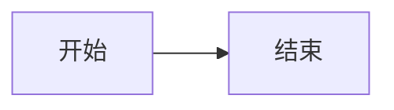
````


## 流程图 (Flowchart)

### 基本流程图

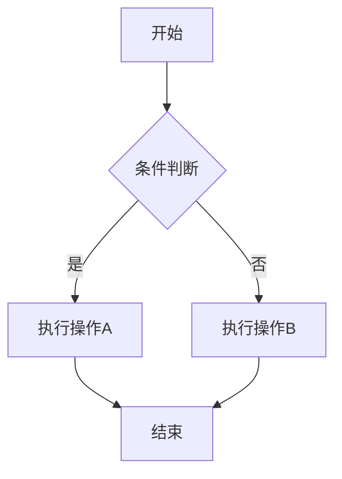

**语法说明**：

````markdown

````

### 方向控制

| 方向 | 说明 |
|:---|:---|
| `TB` 或 `TD` | 从上到下 |
| `BT` | 从下到上 |
| `LR` | 从左到右 |
| `RL` | 从右到左 |

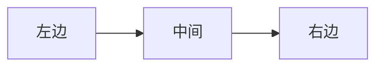

### 节点形状

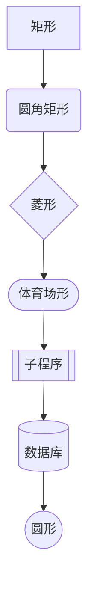

### 连线样式

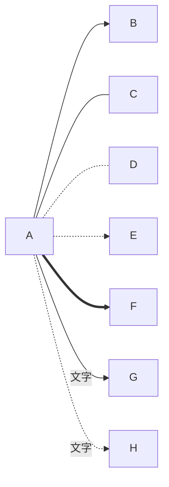

## 时序图 (Sequence Diagram)

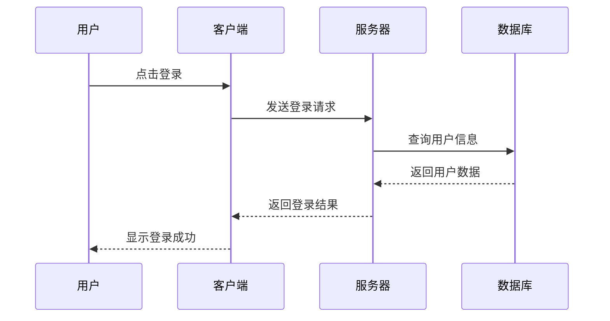

**语法说明**：

````markdown
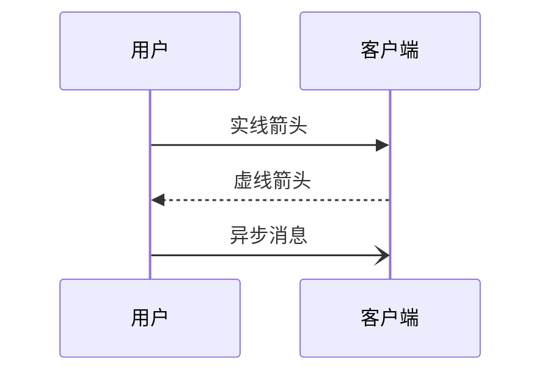
````

### 高级特性

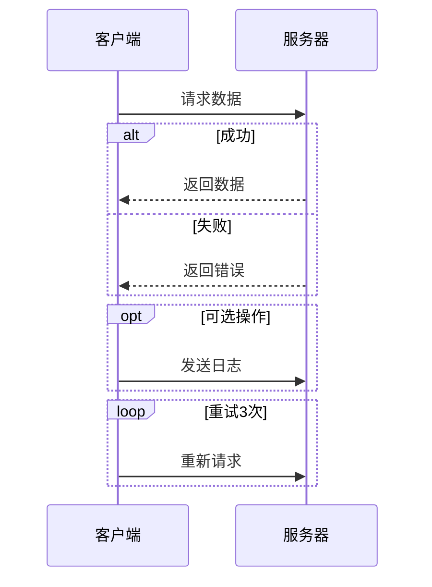

## 类图 (Class Diagram)

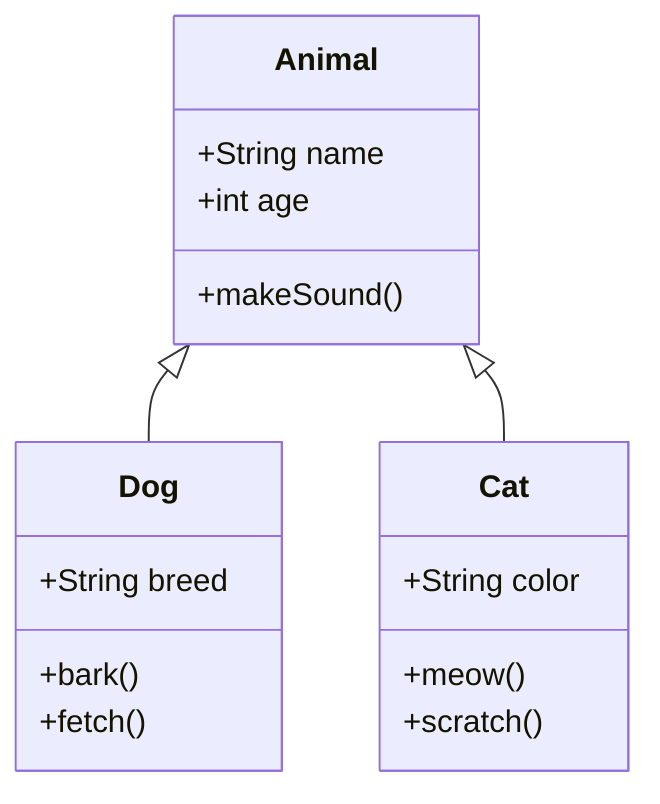

### 关系类型

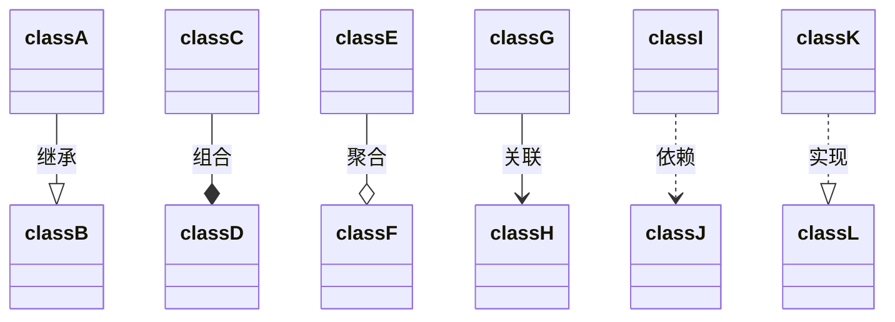

## 状态图 (State Diagram)

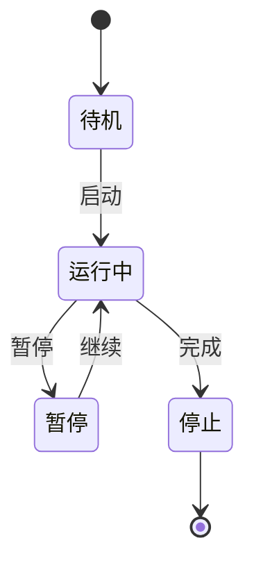

### 复合状态

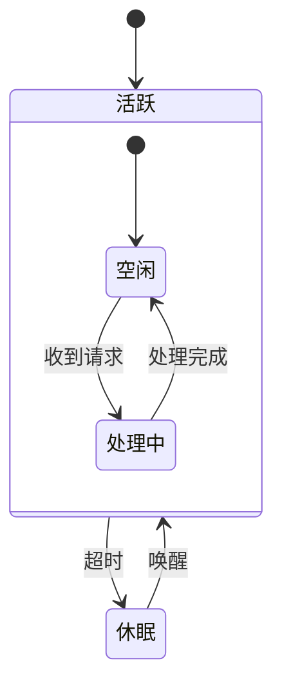

## 甘特图 (Gantt Chart)

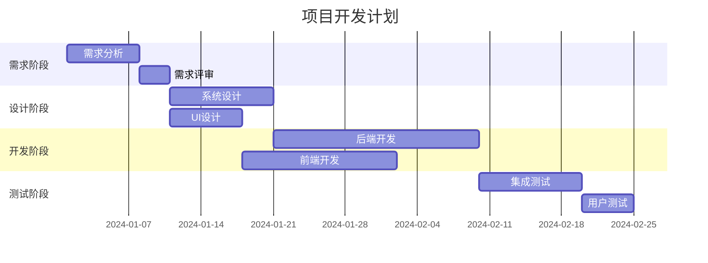

## 饼图 (Pie Chart)

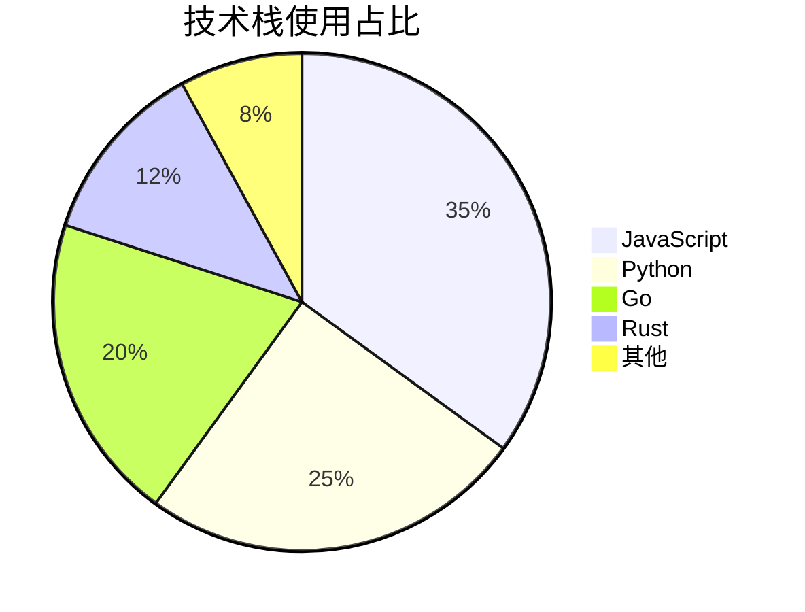

## 实体关系图 (ER Diagram)

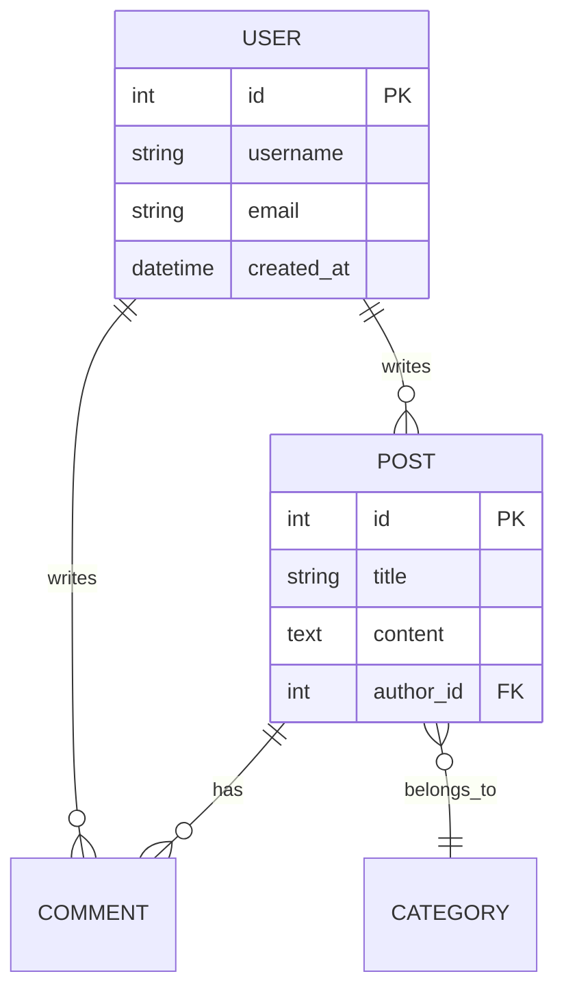

## Git 图 (Git Graph)

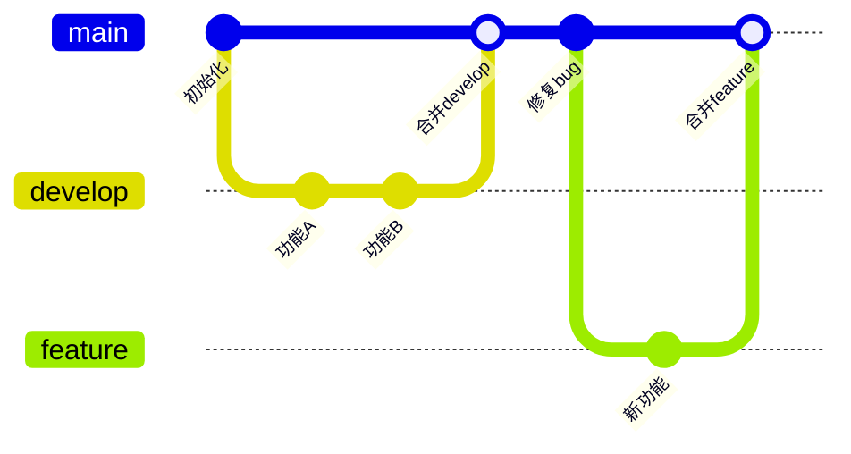

## 用户旅程图 (User Journey)

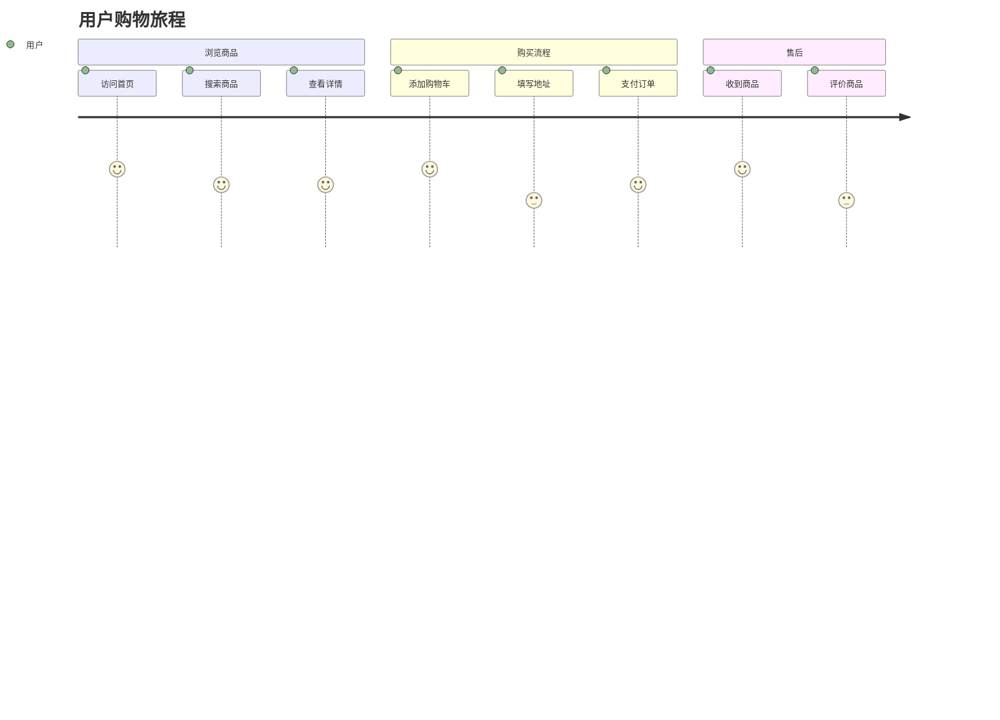

## 实用示例

### API 调用流程

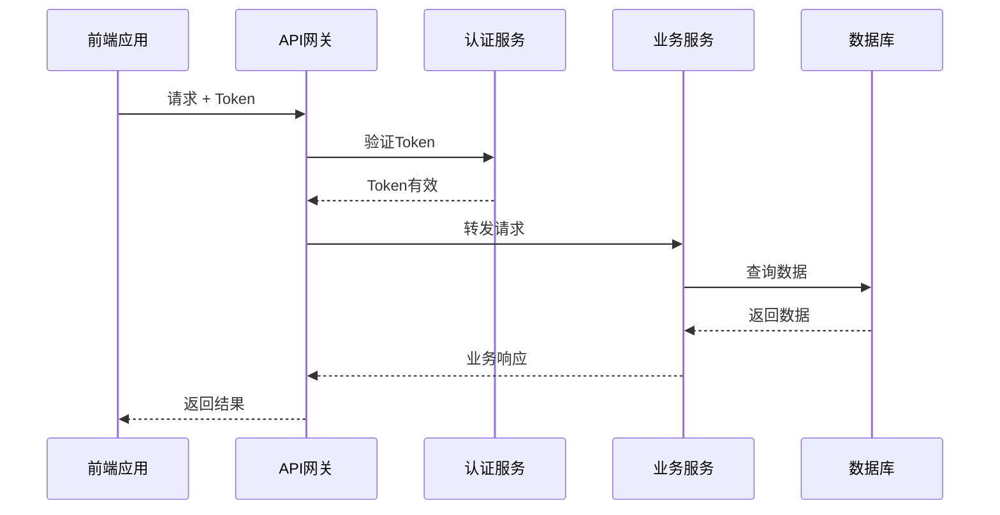

### 系统架构图

```mermaid
graph TB
    subgraph 客户端
        Web[Web应用]
        Mobile[移动应用]
    end

    subgraph 网关层
        LB[负载均衡]
        GW[API网关]
    end

    subgraph 服务层
        US[用户服务]
        OS[订单服务]
        PS[商品服务]
    end

    subgraph 数据层
        MySQL[(MySQL)]
        Redis[(Redis)]
        ES[(Elasticsearch)]
    end

    Web --> LB
    Mobile --> LB
    LB --> GW
    GW --> US
    GW --> OS
    GW --> PS
    US --> MySQL
    US --> Redis
    OS --> MySQL
    PS --> MySQL
    PS --> ES
```

## 全屏预览

对于复杂的图表，元素可能会显示得较小，难以看清细节。本博客提供了全屏预览功能：

### 使用方法

1. **鼠标悬停**：将鼠标移到图表上，右上角会出现全屏按钮
2. **点击按钮**：点击全屏图标进入全屏预览模式
3. **缩放操作**：
   - 使用工具栏的 `+` / `-` 按钮缩放
   - 使用键盘 `+` / `-` / `0`（重置）快捷键
   - 使用鼠标滚轮缩放
4. **拖动平移**：
   - 按住鼠标左键拖动可平移查看图表不同部分
   - 移动端支持触摸拖动
5. **退出全屏**：点击关闭按钮或按 `Esc` 键

::: tip 快捷键与操作
| 操作 | 功能 |
|:---|:---|
| `+` 或 `=` | 放大图表 |
| `-` | 缩小图表 |
| `0` | 重置为 100% |
| `Esc` | 关闭全屏 |
| 鼠标滚轮 | 快速缩放 |
| 左键拖动 | 平移图表 |
| 适配按钮 | 自动适配屏幕大小 |

**注意**：打开全屏时会自动适配屏幕，让图表完整显示在可视区域内。
:::

### 适用场景

全屏预览特别适合以下场景：
- 复杂的系统架构图
- 多参与者的时序图
- 详细的甘特图计划
- 包含大量节点的流程图
- 复杂的实体关系图

## 注意事项

::: warning 渲染提示
- 图表会在页面加载后渲染
- 复杂图表可能需要几秒钟
- 语法错误会导致渲染失败
:::

::: tip 调试技巧
可以使用 [Mermaid Live Editor](https://mermaid.live/) 在线调试图表语法。
:::

## 下一步

- [视频嵌入](./07-video) - 在文章中嵌入视频
- [LaTeX 数学公式](./08-latex) - 学习数学公式排版
