# Mermaid Diagrams

Create beautiful diagrams directly in Markdown using [Mermaid](https://mermaid.js.org).

## Basic Syntax

Use a code block with `mermaid` language:

````markdown
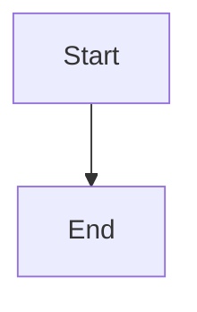
````

## Flowchart

### Basic Flow

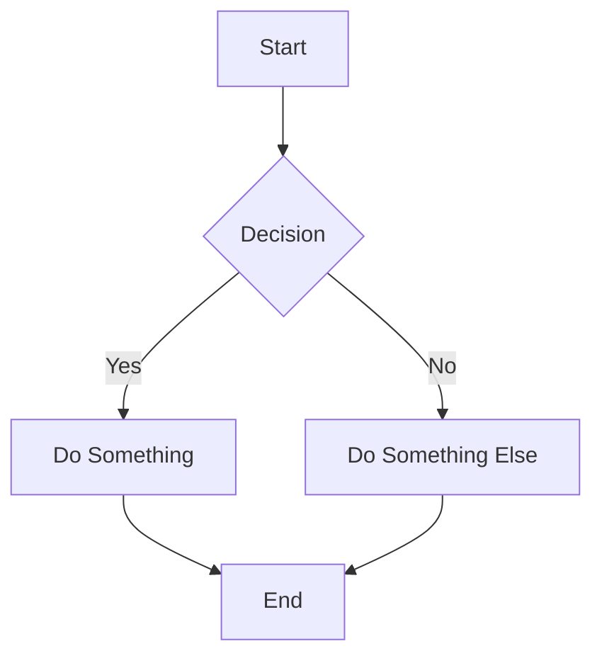

### Left to Right

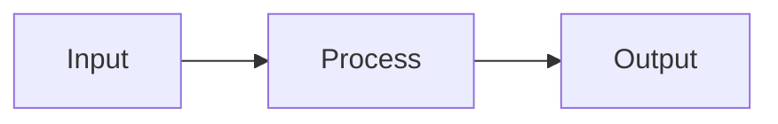

### Node Shapes

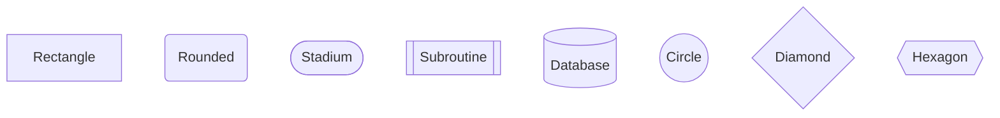

## Sequence Diagram

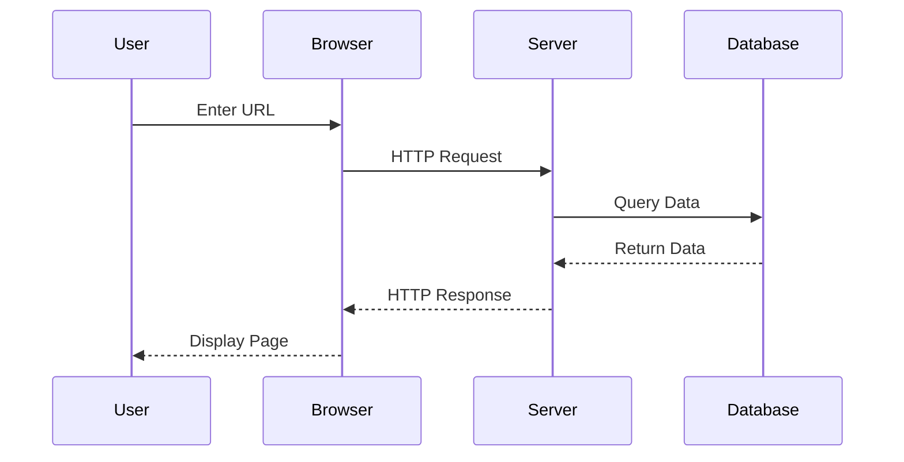

## Class Diagram

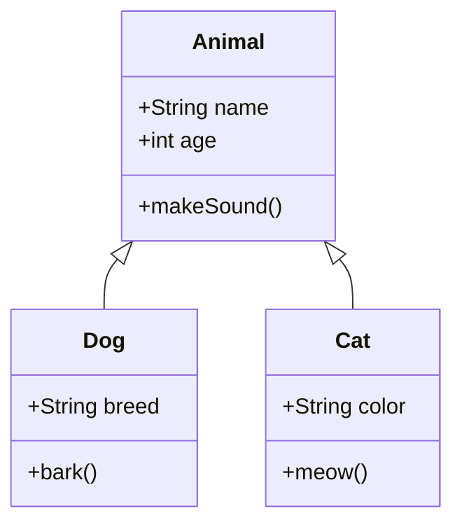

## State Diagram

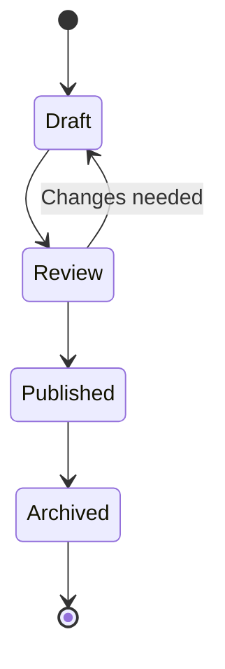

## Gantt Chart

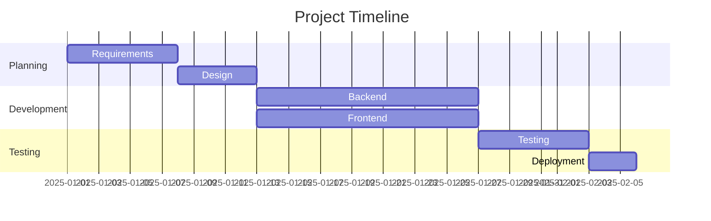

## Pie Chart

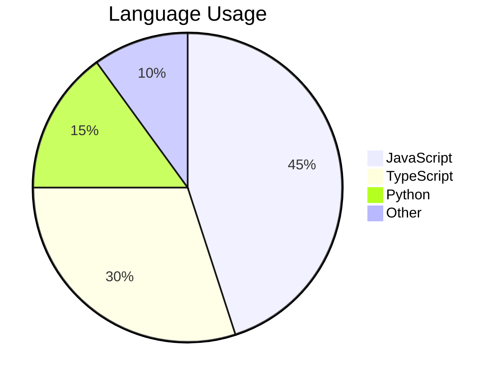

## Entity Relationship

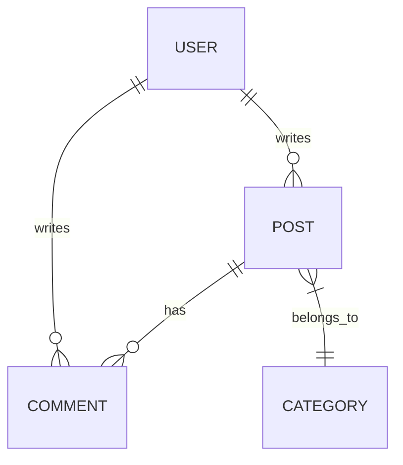

## Git Graph

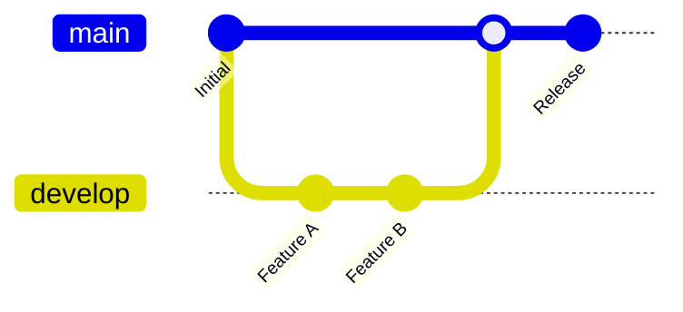

## Styling

### Custom Colors

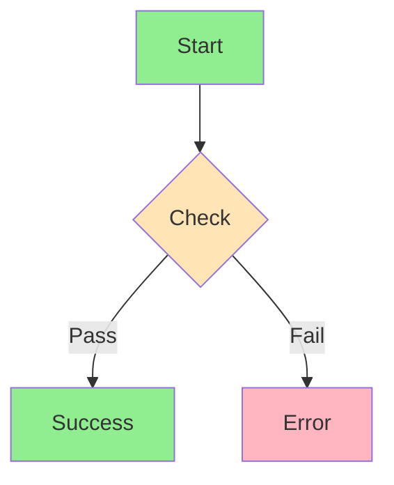

## Tips

::: tip Best Practices
1. **Keep it simple** - Complex diagrams become hard to read
2. **Use meaningful labels** - Clear text improves understanding
3. **Choose the right type** - Match diagram to your content
4. **Test rendering** - Preview before publishing
:::

::: info Learn More
Full documentation: [mermaid.js.org](https://mermaid.js.org/syntax/flowchart.html)
:::

---

Next: [LaTeX Math](./02-latex) for mathematical formulas.
