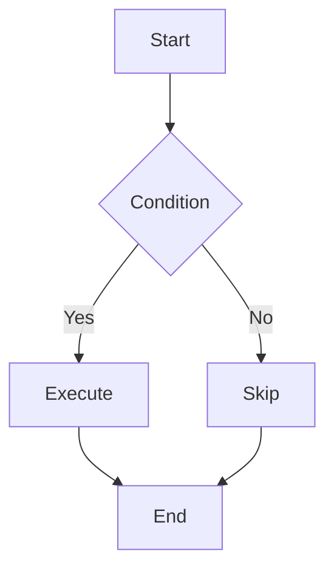

# Slides (Presentations)

This blog integrates [Reveal.js](https://revealjs.com/) to let you create beautiful interactive presentations using Markdown.

## Quick Start

### Creating a Presentation

Create a Markdown file in the `content/slides/` directory:

```markdown
---
title: My Presentation
description: A demo presentation
pubDate: 2025-01-01
theme: black
---

# First Slide

This is the opening

---

## Second Slide

- Point one
- Point two
- Point three

---

# Thank You!
```

### Slide Separators

- Use `---` (three dashes) to separate **horizontal slides**
- Use `----` (four dashes) to separate **vertical slides**

```markdown
# Topic One

---

# Topic Two

This is horizontal navigation

----

## Topic Two Details

This is a vertical sub-slide (press ↓)

----

## More Details

Continue vertical navigation

---

# Topic Three

Back to horizontal navigation
```

## Frontmatter Configuration

| Option | Type | Default | Description |
|:---|:---|:---|:---|
| `title` | string | - | Presentation title (required) |
| `description` | string | - | Presentation description |
| `pubDate` | Date | - | Publication date |
| `author` | string | - | Author |
| `tags` | string[] | [] | Tags |
| `theme` | string | "black" | Theme name |
| `transition` | string | "slide" | Transition animation |
| `controls` | boolean | true | Show control arrows |
| `progress` | boolean | true | Show progress bar |
| `slideNumber` | boolean | false | Show slide numbers |
| `draft` | boolean | false | Draft status |

### Available Themes

| Theme | Description |
|:---|:---|
| `black` | Black background, white text (default) |
| `white` | White background, black text |
| `league` | Gray background |
| `beige` | Beige background, vintage style |
| `night` | Night mode, dark blue background |
| `serif` | Serif fonts, academic style |
| `simple` | Minimalist white |
| `solarized` | Solarized color scheme |

### Transitions

| Transition | Description |
|:---|:---|
| `none` | No animation |
| `fade` | Fade in/out |
| `slide` | Slide (default) |
| `convex` | Convex effect |
| `concave` | Concave effect |
| `zoom` | Zoom effect |

## Writing Content

### Titles and Text

```markdown
# Main Title

## Section Title

Regular paragraph text

**Bold** and *italic*

> Blockquote
```

### Lists

```markdown
## Unordered List

- Item one
- Item two
- Item three

---

## Ordered List

1. First step
2. Second step
3. Third step
```

### Code Highlighting

````markdown
## Code Example

```javascript
function hello(name) {
  console.log(`Hello, ${name}!`);
}

hello('World');
```
````

Supports syntax highlighting for all common programming languages.

### Math Formulas

LaTeX math formulas are supported:

```markdown
## Math Formulas

Inline: $E = mc^2$

Block:

$$
\int_{-\infty}^{\infty} e^{-x^2} dx = \sqrt{\pi}
$$
```

### Mermaid Diagrams

````markdown
## Flowchart


````

### Column Layout

```html
## Two Columns

<div style="display: flex; gap: 2rem;">
<div style="flex: 1;">

### Left Side

- Content one
- Content two

</div>
<div style="flex: 1;">

### Right Side

- Content three
- Content four

</div>
</div>
```

### Images

```markdown
## Image Display


```

### Tables

```markdown
## Comparison

| Feature | Option A | Option B |
|:---|:---:|:---:|
| Performance | High | Medium |
| Usability | Medium | High |
| Cost | Low | Medium |
```

## Fragment Animations

Use HTML attributes to add step-by-step reveal effects:

```html
## Step by Step

<ul>
  <li class="fragment">Step one</li>
  <li class="fragment">Step two</li>
  <li class="fragment">Step three</li>
</ul>
```

### Fragment Types

```html
<p class="fragment fade-in">Fade in</p>
<p class="fragment fade-out">Fade out</p>
<p class="fragment highlight-red">Highlight red</p>
<p class="fragment highlight-blue">Highlight blue</p>
<p class="fragment grow">Grow</p>
<p class="fragment shrink">Shrink</p>
```

## Keyboard Shortcuts

Available shortcuts in presentation mode:

| Shortcut | Function |
|:---|:---|
| `→` / `←` | Horizontal navigation |
| `↓` / `↑` | Vertical navigation |
| `Space` | Next slide |
| `Esc` | Overview mode |
| `F` | Fullscreen mode |
| `S` | Speaker view |
| `B` | Black screen pause |
| `?` | Show help |

## Speaker View

Press `S` to open speaker view, which shows:

- Current slide
- Next slide preview
- Speaker notes
- Timer

### Adding Speaker Notes

```markdown
## Slide Title

Slide content

Note:
These are speaker notes that the audience won't see.
You can write prompts, key points, etc.
```

## File Organization

Recommended directory structure:

```
content/
└── slides/
    ├── my-presentation.md     # Single presentation
    └── workshop/              # Series
        ├── 01-intro.md
        ├── 02-basics.md
        └── 03-advanced.md
```

## Best Practices

::: tip Keep It Simple
Focus on one key point per slide. Avoid information overload.
:::

::: tip Visual Hierarchy
- Use headings to establish structure
- Use lists and diagrams effectively
- Leave appropriate whitespace
:::

::: tip Code Presentation
- Keep code snippets short
- Highlight key parts
- Add explanatory text
:::

::: warning Performance
- Optimize and compress images
- Avoid extremely long presentations
- Complex diagrams may need loading time
:::

## Example Presentations

Visit the `/slides` page to browse example presentations, including:

- Basic syntax demo
- Code highlighting examples
- Math formula showcase
- Mermaid diagrams
- Theme previews

---

Next: Check out [Icons](./04-icons) for visual elements.
