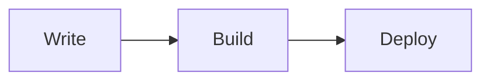

# Advanced Features

Take your content to the next level with these powerful features.

## Feature Overview

| Feature | Description |
|---------|-------------|
| [Mermaid Diagrams](./01-mermaid) | Flowcharts, sequences, Gantt charts |
| [LaTeX Math](./02-latex) | Mathematical formulas and equations |
| [Video Embedding](./03-video) | YouTube, Bilibili, custom videos |
| [Icons](./04-icons) | 5000+ icons from multiple libraries |

## Quick Examples

### Diagrams

### Math

Inline: $E = mc^2$

Block:
$$
\int_0^\infty e^{-x^2} dx = \frac{\sqrt{\pi}}{2}
$$

### Icons

Use icons anywhere: <i class="fas fa-star"></i> <i class="ri-heart-fill"></i>

---

Start with [Mermaid Diagrams](./01-mermaid)!
