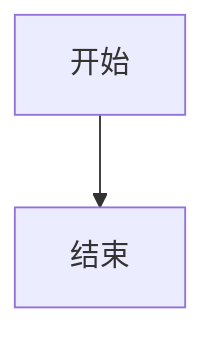
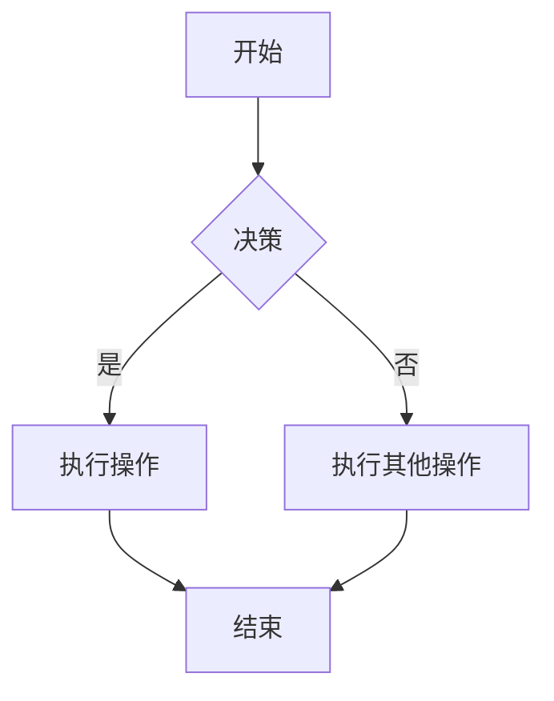
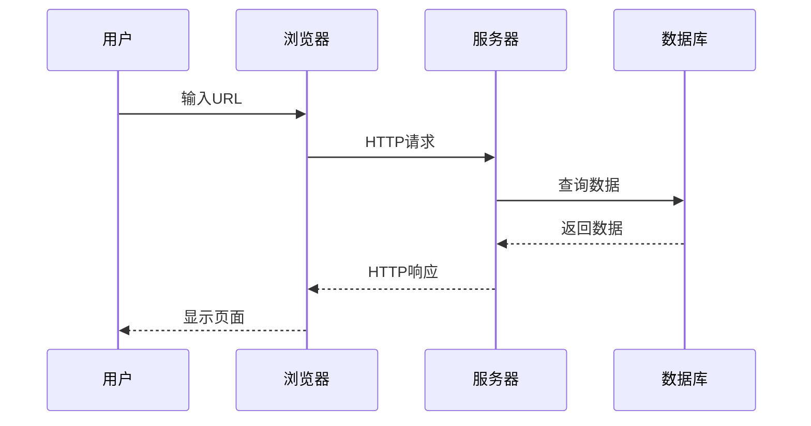
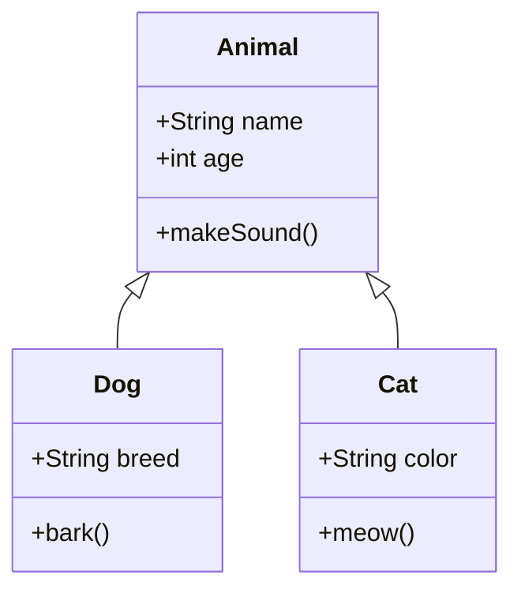
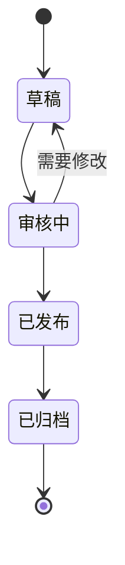
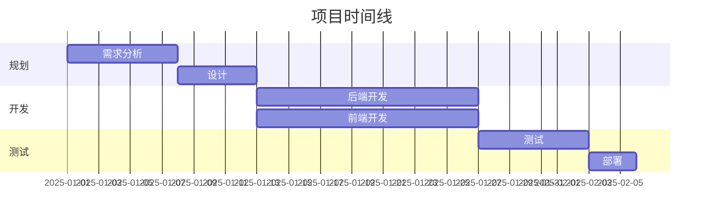
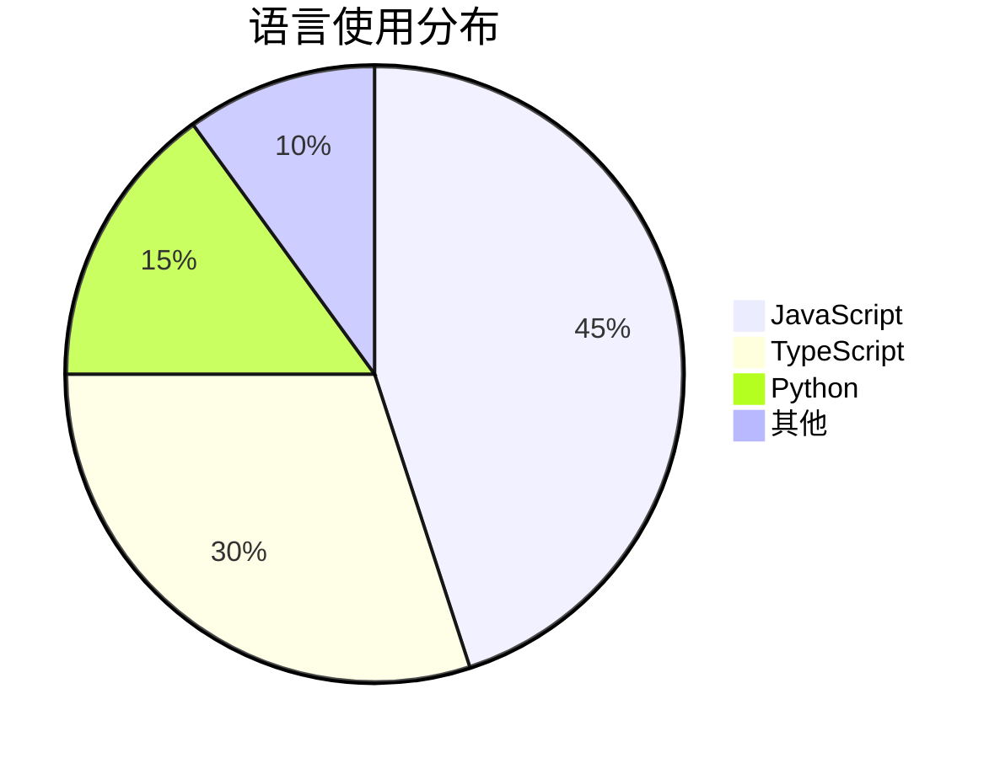
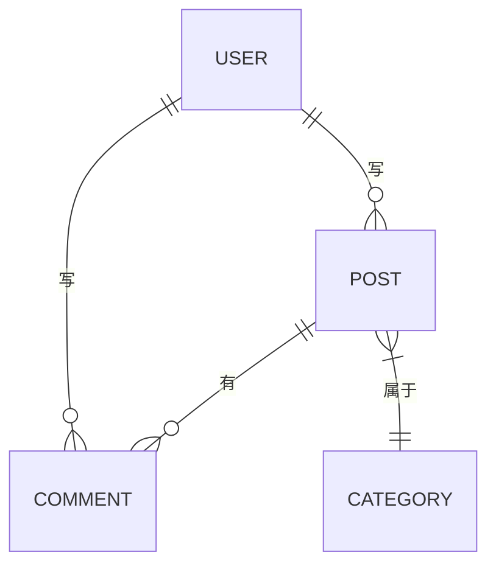
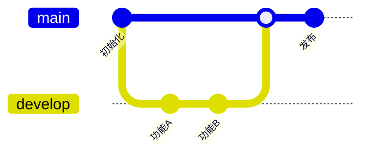
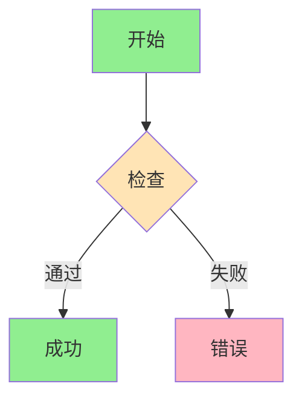

# Mermaid 图表

使用 [Mermaid](https://mermaid.js.org) 直接在 Markdown 中创建精美的图表。

## 基本语法

使用 `mermaid` 语言的代码块：

````markdown

````

## 流程图

### 基本流程



### 从左到右


### 节点形状


## 时序图



## 类图



## 状态图



## 甘特图



## 饼图



## 实体关系图



## Git 图



## 样式

### 自定义颜色



## 提示

::: tip 最佳实践
1. **保持简单** - 复杂的图表会变得难以阅读
2. **使用有意义的标签** - 清晰的文字提高理解度
3. **选择正确的类型** - 根据内容匹配图表类型
4. **测试渲染** - 发布前预览效果
:::

::: info 了解更多
完整文档：[mermaid.js.org](https://mermaid.js.org/syntax/flowchart.html)
:::

---

下一步：[LaTeX 数学](./06-latex) 了解数学公式渲染。
