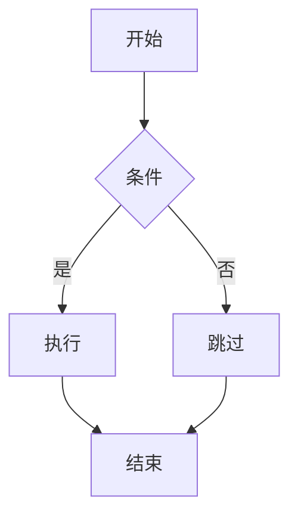

# 幻灯片（演示文稿）

本博客集成了 [Reveal.js](https://revealjs.com/)，让你可以使用 Markdown 创建精美的交互式演示文稿。

## 快速开始

### 创建演示文稿

在 `content/slides/` 目录创建一个 Markdown 文件：

```markdown
---
title: 我的演示文稿
description: 一个演示
pubDate: 2025-01-01
theme: black
---

# 第一页

这是开场

---

## 第二页

- 要点一
- 要点二
- 要点三

---

# 谢谢！
```

### 页面分隔符

- 使用 `---`（三个短横线）分隔**水平页面**
- 使用 `----`（四个短横线）分隔**垂直页面**

```markdown
# 主题一

---

# 主题二

这是水平导航

----

## 主题二详情

这是垂直子页面（按 ↓）

----

## 更多详情

继续垂直导航

---

# 主题三

回到水平导航
```

## Frontmatter 配置

| 选项 | 类型 | 默认值 | 描述 |
|:-----|:-----|:-------|:-----|
| `title` | string | - | 演示文稿标题（必填） |
| `description` | string | - | 演示文稿描述 |
| `pubDate` | Date | - | 发布日期 |
| `author` | string | - | 作者 |
| `tags` | string[] | [] | 标签 |
| `theme` | string | "black" | 主题名称 |
| `transition` | string | "slide" | 过渡动画 |
| `controls` | boolean | true | 显示控制箭头 |
| `progress` | boolean | true | 显示进度条 |
| `slideNumber` | boolean | false | 显示页码 |
| `draft` | boolean | false | 草稿状态 |

### 可用主题

| 主题 | 描述 |
|:-----|:-----|
| `black` | 黑色背景，白色文字（默认） |
| `white` | 白色背景，黑色文字 |
| `league` | 灰色背景 |
| `beige` | 米色背景，复古风格 |
| `night` | 夜间模式，深蓝背景 |
| `serif` | 衬线字体，学术风格 |
| `simple` | 极简白色 |
| `solarized` | Solarized 配色方案 |

### 过渡效果

| 过渡 | 描述 |
|:-----|:-----|
| `none` | 无动画 |
| `fade` | 淡入淡出 |
| `slide` | 滑动（默认） |
| `convex` | 凸面效果 |
| `concave` | 凹面效果 |
| `zoom` | 缩放效果 |

## 编写内容

### 标题和文本

```markdown
# 主标题

## 章节标题

普通段落文本

**粗体** 和 *斜体*

> 引用块
```

### 列表

```markdown
## 无序列表

- 项目一
- 项目二
- 项目三

---

## 有序列表

1. 第一步
2. 第二步
3. 第三步
```

### 代码高亮

````markdown
## 代码示例

```javascript
function hello(name) {
  console.log(`Hello, ${name}!`);
}

hello('World');
```
````

支持所有常见编程语言的语法高亮。

### 数学公式

支持 LaTeX 数学公式：

```markdown
## 数学公式

行内：$E = mc^2$

块级：

$$
\int_{-\infty}^{\infty} e^{-x^2} dx = \sqrt{\pi}
$$
```

### Mermaid 图表

````markdown
## 流程图


````

### 分栏布局

```html
## 双栏

<div style="display: flex; gap: 2rem;">
<div style="flex: 1;">

### 左侧

- 内容一
- 内容二

</div>
<div style="flex: 1;">

### 右侧

- 内容三
- 内容四

</div>
</div>
```

### 图片

```markdown
## 图片展示


```

### 表格

```markdown
## 比较

| 特性 | 方案A | 方案B |
|:-----|:-----:|:-----:|
| 性能 | 高 | 中 |
| 易用性 | 中 | 高 |
| 成本 | 低 | 中 |
```

## 片段动画

使用 HTML 属性添加逐步显示效果：

```html
## 逐步显示

<ul>
  <li class="fragment">第一步</li>
  <li class="fragment">第二步</li>
  <li class="fragment">第三步</li>
</ul>
```

### 片段类型

```html
<p class="fragment fade-in">淡入</p>
<p class="fragment fade-out">淡出</p>
<p class="fragment highlight-red">红色高亮</p>
<p class="fragment highlight-blue">蓝色高亮</p>
<p class="fragment grow">放大</p>
<p class="fragment shrink">缩小</p>
```

## 键盘快捷键

演示模式下可用的快捷键：

| 快捷键 | 功能 |
|:-------|:-----|
| `→` / `←` | 水平导航 |
| `↓` / `↑` | 垂直导航 |
| `Space` | 下一页 |
| `Esc` | 总览模式 |
| `F` | 全屏模式 |
| `S` | 演讲者视图 |
| `B` | 黑屏暂停 |
| `?` | 显示帮助 |

## 演讲者视图

按 `S` 打开演讲者视图，显示：

- 当前页面
- 下一页预览
- 演讲者备注
- 计时器

### 添加演讲者备注

```markdown
## 页面标题

页面内容

Note:
这些是观众看不到的演讲者备注。
你可以写提示、要点等。
```

## 文件组织

推荐的目录结构：

```
content/
└── slides/
    ├── my-presentation.md     # 单个演示文稿
    └── workshop/              # 系列
        ├── 01-intro.md
        ├── 02-basics.md
        └── 03-advanced.md
```

## 最佳实践

::: tip 保持简洁
每页专注一个要点。避免信息过载。
:::

::: tip 视觉层次
- 使用标题建立结构
- 有效使用列表和图表
- 留出适当的空白
:::

::: tip 代码展示
- 保持代码片段简短
- 高亮关键部分
- 添加解释文字
:::

::: warning 性能
- 优化压缩图片
- 避免过长的演示文稿
- 复杂图表可能需要加载时间
:::

## 示例演示文稿

访问 `/slides` 页面浏览示例演示文稿，包括：

- 基本语法演示
- 代码高亮示例
- 数学公式展示
- Mermaid 图表
- 主题预览

---

下一步：查看 [图标](./04-icons) 添加视觉元素。
