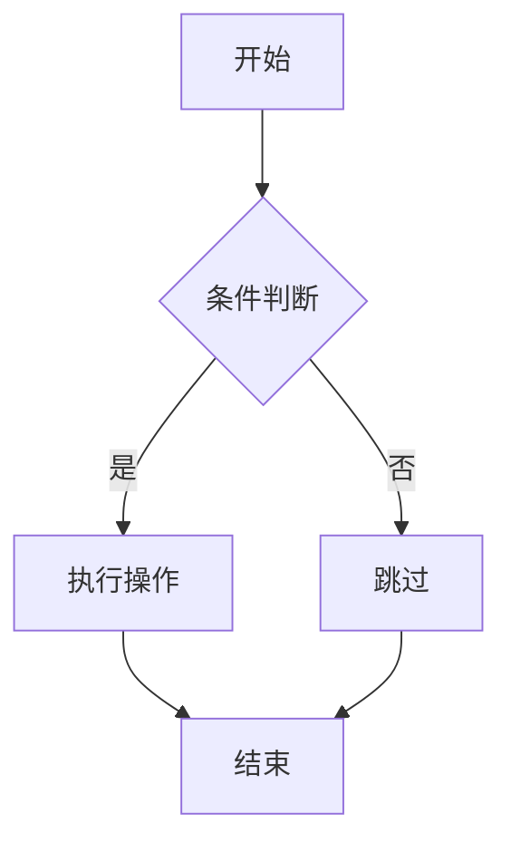

# 欢迎使用 Slides

基于 Reveal.js 的幻灯片演示系统

---

## 功能特性

- 📝 **Markdown 语法支持**
- 🎨 **多种主题可选**
- ✨ **过渡动画效果**
- 📊 **代码高亮**

---

## 代码展示

```javascript
// JavaScript 示例
function greet(name) {
  console.log(`Hello, ${name}!`);
}

greet('World');
```

---

## 垂直幻灯片

使用 `----` 创建垂直幻灯片

按 ↓ 键继续

----

### 这是垂直子页面

你可以使用垂直方向组织内容层次

----

### 另一个垂直页面

按 → 键返回主线

---

## 数学公式支持

行内公式: $E = mc^2$

块级公式:

$$
\frac{d}{dx}\left( \int_{0}^{x} f(u)\,du\right)=f(x)
$$

---

## Mermaid 图表



---

## 分栏布局

<div style="display: flex; justify-content: space-around;">
<div style="flex: 1;">

### 左侧内容
- 项目一
- 项目二
- 项目三

</div>
<div style="flex: 1;">

### 右侧内容
- 项目四
- 项目五
- 项目六

</div>
</div>

---

## 图片展示

支持标准 Markdown 图片语法

```markdown

```

---

## 可用主题

| 主题 | 说明 |
|------|------|
| black | 黑色背景（默认）|
| white | 白色背景 |
| league | 灰色背景 |
| beige | 米色背景 |
| night | 夜间模式 |
| serif | 衬线字体 |

---

## 键盘快捷键

- **→ / ←**: 前进/后退
- **↑ / ↓**: 垂直导航
- **Space**: 下一页
- **Esc**: 概览模式
- **F**: 全屏模式
- **S**: 演讲者视图

---

# 谢谢！

开始创建你的演示吧 🚀
