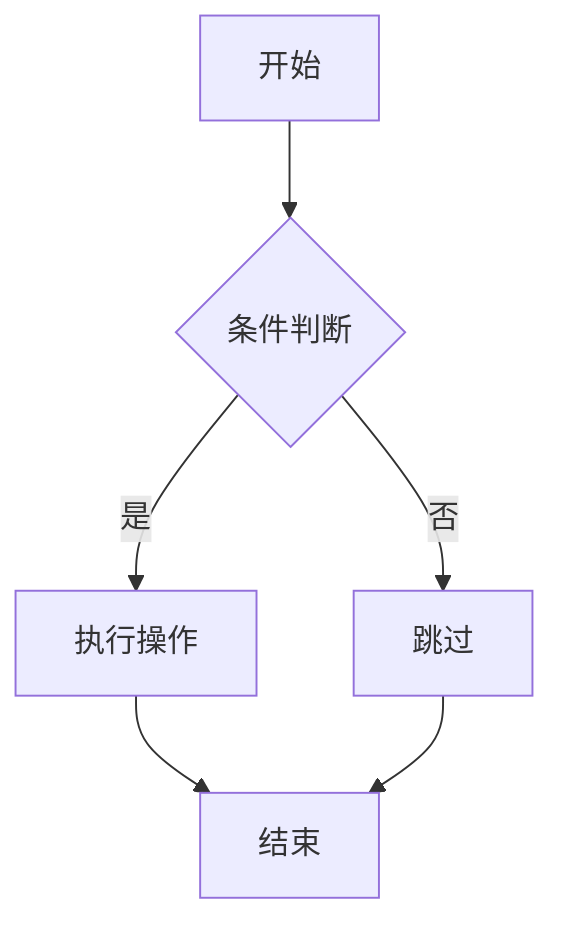
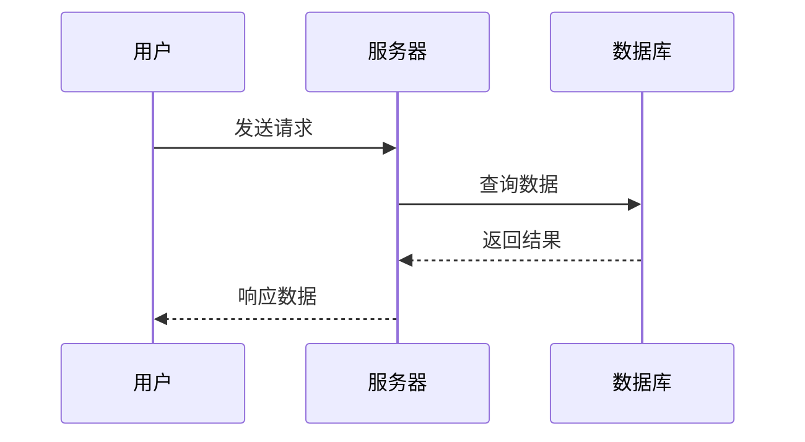
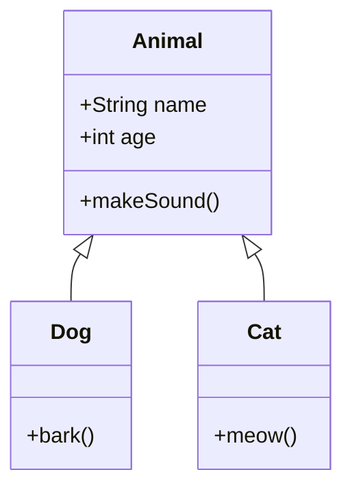
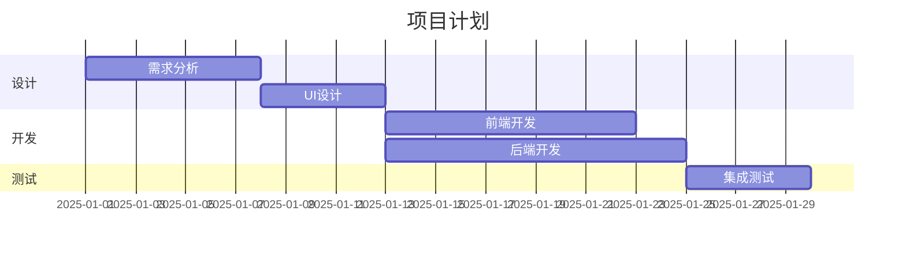
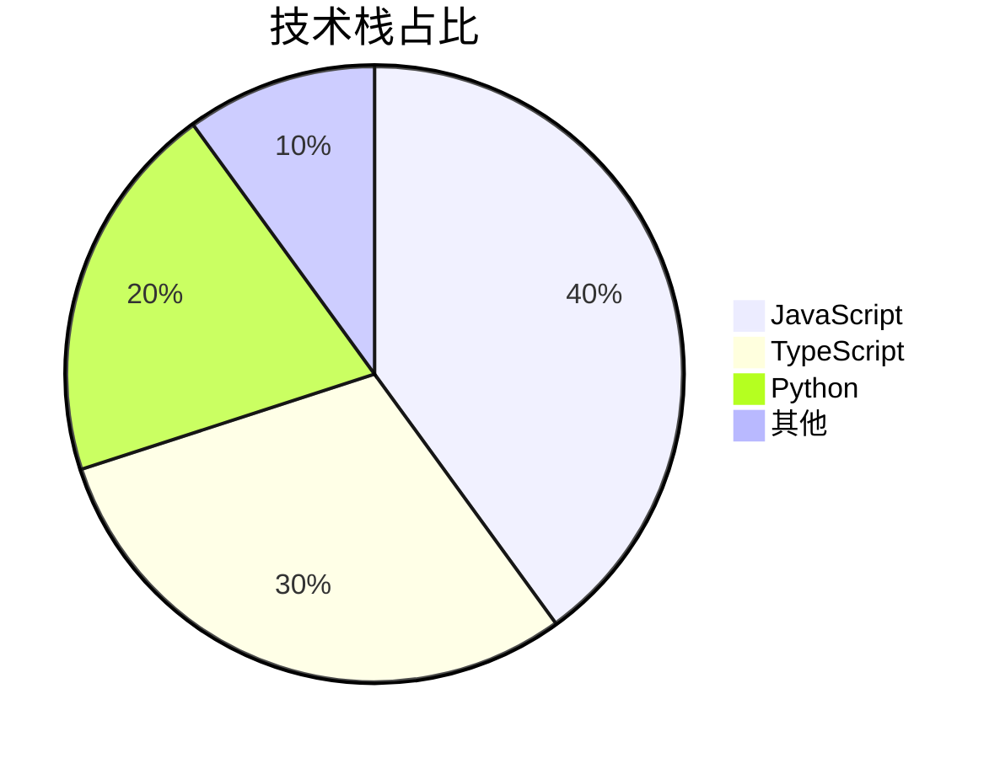
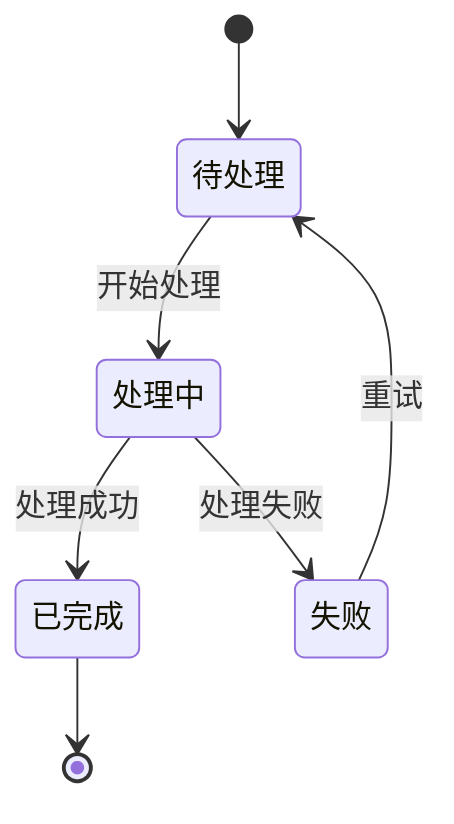

## Mermaid 图表

在幻灯片中使用 Mermaid 绘制各种图表

---

## 流程图

```mermaid
graph TD
    A[开始] --> B{条件判断}
    B -->|是| C[执行操作]
    B -->|否| D[跳过]
    C --> E[结束]
    D --> E
```

---

## 时序图

```mermaid
sequenceDiagram
    participant U as 用户
    participant S as 服务器
    participant D as 数据库
    U->>S: 发送请求
    S->>D: 查询数据
    D-->>S: 返回结果
    S-->>U: 响应数据
```

---

## 类图

```mermaid
classDiagram
    class Animal {
        +String name
        +int age
        +makeSound()
    }
    class Dog {
        +bark()
    }
    class Cat {
        +meow()
    }
    Animal <|-- Dog
    Animal <|-- Cat
```

---

## 甘特图

```mermaid
gantt
    title 项目计划
    dateFormat  YYYY-MM-DD
    section 设计
    需求分析    :a1, 2025-01-01, 7d
    UI设计      :a2, after a1, 5d
    section 开发
    前端开发    :b1, after a2, 10d
    后端开发    :b2, after a2, 12d
    section 测试
    集成测试    :c1, after b2, 5d
```

---

## 饼图

```mermaid
pie title 技术栈占比
    "JavaScript" : 40
    "TypeScript" : 30
    "Python" : 20
    "其他" : 10
```

---

## 状态图

```mermaid
stateDiagram-v2
    [*] --> 待处理
    待处理 --> 处理中: 开始处理
    处理中 --> 已完成: 处理成功
    处理中 --> 失败: 处理失败
    失败 --> 待处理: 重试
    已完成 --> [*]
```
